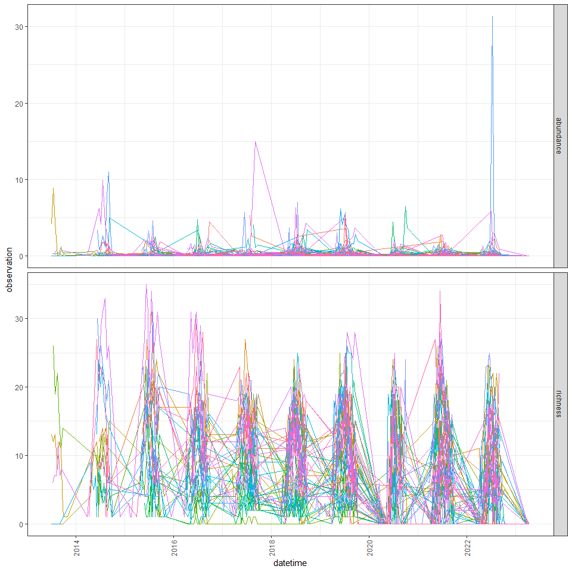
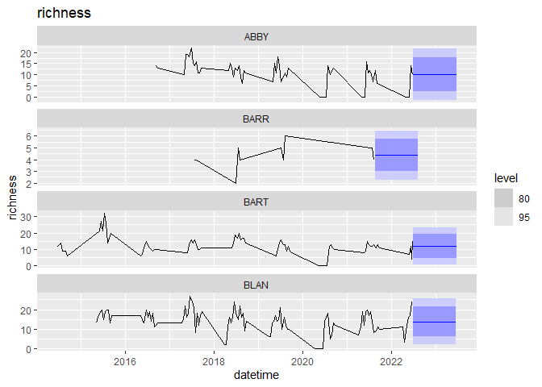
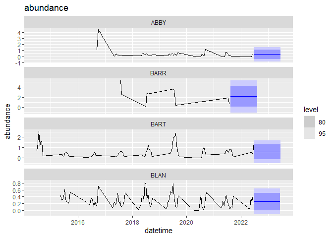
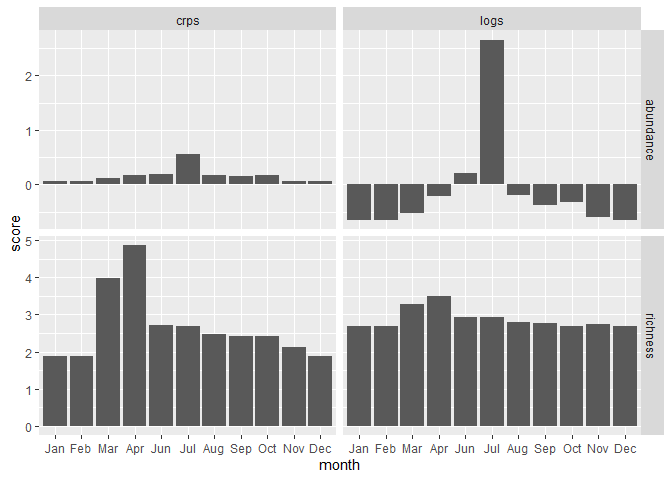

# 1 Introduction

## 1.1 Purpose

This document provides a tutorial on how to prepare and submit forecasts
to the [NEON Ecological Forecasting Challenge Beetle Communities
Theme](https://projects.ecoforecast.org/neon4cast-docs/Beetles.html). We
describe the motivation for and challenges associated with forecasting
communities. We suggest forecasts that users could submit that would
account for challenges in the beetle communities data and provide an
example forecast.

## 1.2 Motivation

The motivation for this tutorial is to increase interest and submissions
to the Beetle Communities Theme. We believe the general challenges
associated with forecasting communities (see below), lack of clarity in
how community metrics are calculated, and latency in the availability of
the observed data to validate forecasts, have prevented both interest
and confidence to submit forecasts. The goal of this tutorial is to
remove those barriers to increase users’ confidence in forecasting
communities and thereby increase numbers of submissions to the Beetle
Communities Theme.

## 1.3 Target user groups for this tutorial

This tutorial is intended to be used by forecasters at any stage of
expertise, including as a learning tool for those interested in learning
about forecasting. At a beginner level, our sample forecasts can be
worked through to understand how a community forecast may be built. More
advanced users can use the sample forecasts as building blocks for more
complex models or choose to tackle one of suggested challenges below.

## 1.4 Goals for ecological forecasts of ecological communities

Ecologists are interested in tracking changes in the **number of
individual organisms over time** (count data of abundance). Numbers of
each species will change due to births, deaths, and movement in
(immigration) or out (emigration) of population. The abundance of an
ecological community is the sum of the number of individuals of each
species. For example, in a hypothetical community of beetles sampled in
Year 1 (time=1) , Species A has 10 individuals, Species B has 40
individuals and Species C has 50 individuals, giving a community
abundance of 100. In subsequent years the abundance may increase,
decrease or remain constant. The forecast uses this sequence of
observations over time to predict how many individuals there will be in
the next year (time=2), or a number of years into the future (time n).
How far into the future we predict is known as the forecast horizon. The
accuracy of the prediction is then compared to new observations and a
new prediction is made.

Ecologists are also interested in tracking changes in the **number of
species over time** (Species richness over time without species
identity) and in species turnover over time steps where the identity of
the species is known. In the example above there are three species
(A,B,C) but over time this can change if for example Species C was to
decline from 10 to zero individuals then the species richness would be
2, or increase if two previously unobserved species (D & E) arrive into
the community, the species richness would be 4. Note that the loss of A
and the arrival of 2 gives a net species richness of 4 but without
keeping track of the identity of species we would be unaware of the
details of that change.

Ecological communities change for many reasons and so it is important to
understand the drivers of changes in abundance or species richness by
adding environmental variables into the models. By knowing how species
change over time we can use the driving variables to predict the values
for the abundance and species richness variables for the ecological
communities into the future, that is to forecast.

## 1.5 General challenges for forecasting communities

1.  Understanding what data you have
    1.  How data have been cleaned and organized
    2.  Time series and data collection design
    3.  Activity vs. abundance for pitfall sampling methods (see later
        notes)
    4.  Destructive sampling (individuals are removed from the
        environment)
2.  How to handle missing data and/or zeros (are they really zeros or
    missing?)
3.  When there is latency in validating forecasts, do you use known data
    or forecasted data (e.g. when you get your beetle ID’s at a later
    date, do you use your known weather data or do you use your
    forecasted data on which you made the model?)
4.  What scale are you interested in? Community versus species? Plot
    versus site?
5.  What covariates are most informative (soil, temperature, other)? How
    to systematically rule things in or out?
6.  How do lags and variable lags across species impact our forecasts?
7.  How to use multi-species data with different life histories to
    inform your forecasts?

## 1.6 Avoiding pitfalls: list of forecast options to address the challenges of forecasting populations and communities

1.  Challenge: Many zeros in the data
    1.  Fit with zero-inflated poisson (ZIP)
    2.  Fit with negative binomial
2.  Challenge: Finding the optimal scale
    1.  Compare forecast accuracy at plot vs site level
3.  Challenge: Temporal and spatial variation/variation in scale
    1.  Increase biological complexity
    2.  Landuse types (e.g., NLCD)

    <!-- -->

    1.  Climate
    2.  Timing pesticide application
    3.  Disturbance/management events (e.g., prescribed burns)
4.  Challenge: Differences between individuals or species
    1.  Multi species habitat suitability modeling
    2.  Integral projection population modeling
5.  Challenge: Testing various community/diversity metrics & functional
    diversity indices
    1.  Relative abundance of species
    2.  Total beetle abundance
    3.  Beetles in functional groups
    4.  Functional dispersion, richness and evenness
    5.  Separating species rare or common species trends

## 1.7 Things you will need to complete this tutorial

You will need a current version of R (v4.2 or newer) to complete this
tutorial. We also recommend the RStudio IDE to work with R. It’s also
worth checking your Rtools is up to date and compatible with R 4.2, see
(<https://cran.r-project.org/bin/windows/Rtools/rtools42/rtools.html>).

To complete the workshop via this markdown document the following
packages will need to be installed:

-   `tidyverse`
-   `lubridate`
-   `tsibble`
-   `fable`
-   `remotes` (to install neon4cast from gitHub)
-   `neon4cast` (from github)

The following code chunk should be run to install packages.

``` r
install.packages('remotes')
install.packages('tsibble') # package for dealing with time series data sets and tsibble objects
install.packages('tidyverse') # collection of R packages for data manipulation, analysis, and visualisation
install.packages('lubridate') # working with dates and times
remotes::install_github('eco4cast/neon4cast') # package from NEON4cast challenge organisers to assist with forecast building and submission
install.packages('fable') # package for running forecasts
```

``` r
version$version.string
```

    ## [1] "R version 4.2.2 (2022-10-31 ucrt)"

``` r
library(tidyverse)
```

    ## Warning: package 'tidyverse' was built under R version 4.2.3

    ## ── Attaching core tidyverse packages ──────────────────────── tidyverse 2.0.0 ──
    ## ✔ dplyr     1.1.0     ✔ readr     2.1.4
    ## ✔ forcats   1.0.0     ✔ stringr   1.5.0
    ## ✔ ggplot2   3.4.1     ✔ tibble    3.1.8
    ## ✔ lubridate 1.9.2     ✔ tidyr     1.3.0
    ## ✔ purrr     1.0.1     
    ## ── Conflicts ────────────────────────────────────────── tidyverse_conflicts() ──
    ## ✖ dplyr::filter() masks stats::filter()
    ## ✖ dplyr::lag()    masks stats::lag()
    ## ℹ Use the ]8;;http://conflicted.r-lib.org/conflicted package]8;; to force all conflicts to become errors

``` r
library(lubridate)
library(tsibble)
```

    ## Warning: package 'tsibble' was built under R version 4.2.3

    ## 
    ## Attaching package: 'tsibble'
    ## 
    ## The following object is masked from 'package:lubridate':
    ## 
    ##     interval
    ## 
    ## The following objects are masked from 'package:base':
    ## 
    ##     intersect, setdiff, union

``` r
library(fable)
```

    ## Loading required package: fabletools

``` r
library(neon4cast)
```

If you do not wish to run the code yourself you can follow along via the
html (NEON_forecast_challenge_workshop.md), which can be downloaded from
the [Github
repository](#add%20link%20to%20rendered%20.md%20document%20here).

# 2 Introduction to NEON forecast challenge

The EFI RCN NEON Forecast Challenge asks the scientific community to
produce ecological forecasts of future conditions at NEON sites by
leveraging NEON’s open data products. The Challenge is split into five
themes that span aquatic and terrestrial systems, and population,
community, and ecosystem processes across a broad range of ecoregions.
We are excited to use this Challenge to learn more about the
predictability of ecological processes by forecasting NEON data before
it is collected.

Which modeling frameworks, mechanistic processes, and statistical
approaches best capture community, population, and ecosystem dynamics?
These questions are answerable by a community generating a diverse array
of forecasts. The Challenge is open to any individual or team from
anywhere around the world that wants to submit forecasts. Sign up
[here.](https://projects.ecoforecast.org/neon4cast-docs/Participation.html).

## 2.1 Beetles Challenge

What:

Where:

When:

## 2.2 Submission requirements

For the Challange, forecasts must include quantified uncertainty. The
file can represent uncertainty using an ensemble forecast (multiple
realizations of future conditions) or a distribution forecast (with mean
and standard deviation), specified in the family and parameter columns
of the forecast file.

For an ensemble forecast, the `family` column uses the word `ensemble`
to designate that it is a ensemble forecast and the parameter column is
the ensemble member number (1, 2, 3 …). For a distribution forecast, the
`family` column uses the word `normal` to designate a normal
distribution and the parameter column must have the words mu and sigma
for each forecasted variable, site_id, and datetime. For forecasts that
don’t have a normal distribution we recommend using the ensemble format
and sampling from your non-normal distribution to generate a set of
ensemble members that represents your distribution. I will go through
examples of both `ensemble` and `normal` forecasts as examples.

The full list of required columns and format can be found in the
[Challenge
documentation](https://projects.ecoforecast.org/neon4cast-docs/Submission-Instructions.html).

# 3 The forecasting workflow

## 3.1 Read in the data

We start forecasting by first looking at the historic data - called the
‘targets’. These data are available with a latency of approximately 600
days. Here is how you read in the data from the targets file available
from the EFI server.

``` r
#read in the targets data
targets <- read_csv('https://data.ecoforecast.org/neon4cast-targets/beetles/beetles-targets.csv.gz')
```

Information on the NEON sites can be found on the [NEON
webpage](https://www.neonscience.org/field-sites/explore-field-sites).
It can be filtered to only include terrestrial sites. This table has
information about the field sites, including location, ecoregion,
information about the plots (e.g. elevation, mean annual precipitation
and temperature, and NLCD class).

``` r
# read in the sites data
# aquatic_sites <- read_csv("https://raw.githubusercontent.com/eco4cast/neon4cast-targets/main/NEON_Field_Site_Metadata_20220412.csv") |>
#   dplyr::filter(aquatics == 1)

neon_sites <- read_csv('https://www.neonscience.org/sites/default/files/NEON_Field_Site_Metadata_20230309.csv')
```

Let’s take a look at the targets data!

    ## # A tibble: 11 × 5
    ##    datetime   site_id variable  observation iso_week
    ##    <date>     <chr>   <chr>           <dbl> <chr>   
    ##  1 2021-09-13 CPER    richness       13     2021-W37
    ##  2 2021-09-27 CPER    abundance       0.171 2021-W39
    ##  3 2021-09-27 CPER    richness       11     2021-W39
    ##  4 2021-10-11 CPER    abundance       0.276 2021-W41
    ##  5 2021-10-11 CPER    richness       10     2021-W41
    ##  6 2022-04-11 CPER    abundance       0     2022-W15
    ##  7 2022-04-11 CPER    richness        0     2022-W15
    ##  8 2022-04-25 CPER    abundance       0     2022-W17
    ##  9 2022-04-25 CPER    richness        0     2022-W17
    ## 10 2022-05-09 CPER    abundance       0     2022-W19
    ## 11 2022-05-09 CPER    richness        0     2022-W19

## 3.2 Visualise the data

<figure>

<figcaption aria-hidden="true">Figure: Beetle targets data at NEON
sites</figcaption>
</figure>

We can think about what type of models might be useful to predict these
variables at these sites. Below are descriptions of ?? simple models
which have been constructed to get you started forecasting:

-   Approach 1 - Null model
-   Approach 2 - ARIMA model
-   Approach 3 - description…

## 3.3 Format the data for fitting a forecast

``` r
#targets |> duplicates(index = datetime, key  = c(variable,site_id))

targets_ts <- targets %>%
  as_tsibble(index = datetime, key = c(variable,site_id))
```

``` r
forecast_date <- Sys.Date() - months(12)


past <-  targets_ts |>
  filter(datetime < forecast_date)  |>
  pivot_wider(names_from="variable", values_from="observation")


future <- targets_ts |>
  filter(datetime >= forecast_date)  |>
  pivot_wider(names_from="variable", values_from="observation")
```

### 3.3.1 Approach 1 - Null model forecast

``` r
## Compute a simple mean/sd model per site... obviously silly given huge seasonal aspect
null_richness <- past  %>% 
  model(null = MEAN(richness)) %>%
  forecast(h = "1 year")

null_abundance <- past  %>%
  model(null = MEAN(abundance)) %>%
  forecast(h = "1 year")
```

### 3.3.2 Visualize the forecast

``` r
first4 <- unique(null_richness$site_id)[1:4]

null_richness |> filter(site_id %in% first4)  |> autoplot(past) + ggtitle("richness")
```



``` r
null_abundance |> filter(site_id %in% first4)  |> autoplot(past) + ggtitle("abundance")
```



## 3.4 Convert to EFI standard for submission

For an ensemble forecast the documentation specifies the following
columns:

-   `datetime`: forecast timestamp for each time step
-   `reference_datetime`: The start of the forecast; this should be 0
    times steps in the future. This should only be one value of
    reference_datetime in the file
-   `site_id`: NEON code for site
-   `family`: name of probability distribution that is described by the
    parameter values in the parameter column; only `normal` or
    `ensemble` are currently allowed.
-   `parameter`: integer value for forecast replicate (from the `.rep`
    in fable output);
-   `variable`: standardized variable name from the theme
-   `prediction`: forecasted value (from the `.sim` column in fable
    output)
-   `model_id`: model name (no spaces)

We need to make sure the dataframe is in the correct format and then we
can submit this to the challenge as well! This is an ensemble forecast
(specified in the `family` column).

## 3.5 EFI Formatting

EFI requires a flat-file format for forecasts that avoids the use of
complex list columns.  
To convey uncertainty, forecasts must be expressed either by giving mean
and standard deviation (for predictions that are normally distributed)
or must express forecasts as an ensemble of replicate draws from
forecast distribution. The helper function `efi_format()` handles this
transformation.

``` r
## Combine richness and abundance forecasts.
null_forecast <- bind_rows(efi_format(null_richness), 
                            efi_format(null_abundance)) 
```

Score the forecast using EFI’s internal method. By default, EFI’s method
reports the score every unique site-time combination (unique grouping
variables). It is easy to later average across times for a by-site
score.

``` r
scores_null <- neon4cast::score(null_forecast, targets) |> filter(!is.na(observation))
```

    ## Joining with `by = join_by(model_id, site_id, variable)`

``` r
# average richness scores by site
summary_scores <- scores_null |> 
  mutate(month = lubridate::month(datetime,label=TRUE)) |>
  group_by(variable,month) |>
  summarise(crps = mean(crps, na.rm=TRUE),
            logs = mean(logs, na.rm=TRUE),
            .groups = "drop") |>
  pivot_longer(c(crps, logs), names_to="metric", values_to="score")

summary_scores |>
  ggplot(aes(month, score)) + geom_col() +
  facet_grid(variable ~ metric, scales = "free_y")
```



## 3.6 Submit forecast

Files need to be in the correct format for submission. The forecast
organizers have created tools to help aid in the submission process.
These tools can be downloaded from Github using
`remotes::install_github(eco4cast/neon4cast)`. These include functions
for submitting, scoring and reading forecasts:

-   `submit()` - submit the forecast file to the neon4cast server where
    it will be scored
-   `forecast_output_validator()` - will check the file is in the
    correct format to be submitted
-   `check_submission()` - check that your submission has been uploaded
    to the server

The file name needs to be in the format
theme-reference_datetime-model_id

``` r
# <<need to figure out how to edit this for beetles>>

# Start by writing the forecast to file
theme <- 'beetles'
# date <- null_forecast$datetime[1]
# forecast_name_1 <- paste0(temp_lm_forecast_EFI$model_id[1], ".csv")
# forecast_file_1 <- paste(theme, date, forecast_name_1, sep = '-')
# forecast_file_1
# 
# write_csv(null_forecast, forecast_file_1)

# neon4cast::forecast_output_validator(forecast_file_1)
```

``` r
# can uses the neon4cast::forecast_output_validator() to check the forecast is in the right format
neon4cast::submit(forecast_file = forecast_file_1,
                  ask = FALSE) # if ask = T (default), it will produce a pop-up box asking if you want to submit
```

Is the model reasonable?

# 4 Other things that might be useful

## 4.1 How the forecasts are scored?

The Challenge implements methods from the scoringRules R package to
calculate the Continuous Rank Probability Score (CRPS) via the
`score4cast` package. This scores the optimum is the minimum value, so
we are aiming for as small a value as possible. CRPS uses information
about the variance of the forecasts as well as the estimated mean to
calculate the score by comparing it with the observation. There is some
balance between accuracy and precision. The forecasts will also be
compared with ‘null’ models (RW and climatology) More info can be found
in the
[documentation](https://projects.ecoforecast.org/neon4cast-docs/Evaluation.html)
or the `score4cast` package from EFI organizers
[here](https://github.com/eco4cast/score4cast).

You can view past submissions
[here:](https://projects.ecoforecast.org/neon4cast-dashboard/aquatics.html).
You can also the raw scores from the bucket directly. Have a look at the
get_scores.R file.

## 4.2 Other useful R packages

Check out the NEON4cast R package
([introduction](https://projects.ecoforecast.org/neon4cast-docs/Helpful-Functions.html),
and [github](https://github.com/eco4cast/neon4cast)) for other helpful
functions when developing your workflow for the submitting to the
challenge.

EFI has also produced a package that summarizes the proposed community
standards for the common formatting and archiving of ecological
forecasts. Such open standards are intended to promote interoperability
and facilitate forecast adoption, distribution, validation, and
synthesis
([introduction](https://projects.ecoforecast.org/neon4cast-docs/Helpful-Functions.html#efistandards-package)
and [github](https://github.com/eco4cast/EFIstandards))

## 4.3 Weather variables

You can look at weather variables that are available in the NOAA weather
data. There’s information in the [Challenge
documentation](https://projects.ecoforecast.org/neon4cast-docs/Shared-Forecast-Drivers.html)
too.

## 4.4 File format

The examples shown here, submit the forecast as a *csv* file but you can
also submit your forecasts in *NetCDF* format. See information
[here](https://projects.ecoforecast.org/neon4cast-docs/Submission-Instructions.html#step-1-forecast-file-format)
about the different file formats.

## 4.5 Automating your forecasting workflow

Automation is a key step to producing forecasts once you have your model
up and running and are happy with your forecasts. By automating your
forecasting workflow, reduces the “work” needed to produce the
forecasts. There are many ways to automate scripts that are written to
download observations and meteorology drivers, generate forecasts, and
submit forecasts. Two tools that many have used are cron jobs (see the R
package cronR) that execute tasks at user specifics times and github
actions. There are examples of how you might go about implementing this
in the [example github
repository](https://github.com/eco4cast/neon4cast-example), using github
actions and binder.

## 4.6 Alternative methods to loop through each variable-site_id combination

Using the `purrr` package we can also loop through each combination of
site_id and variable combination. This is more efficient computationally
than the for loop. You need to create a dataframe with each argument as
a column. Then specify this, along with the RW function as arguments in
`pmap_dfr`. The `dfr` part of the function specifies that the output
should be use row_bind into a dataframe.

``` r
site_var_combinations <- 
  # Gets every combination of site_id and variable
  expand.grid(site = unique(targets$site_id),
              var = unique(targets$variable)) %>%
  # assign the transformation depending on the variable.
  mutate(transformation = 'none') %>%
  mutate(boot_number = 200,
         h = 30,
         bootstrap = T, 
         verbose = T)

# Runs the RW forecast for each combination of variable and site_id
RW_forecasts <- purrr::pmap_dfr(site_var_combinations, RW_daily_forecast) 
```
