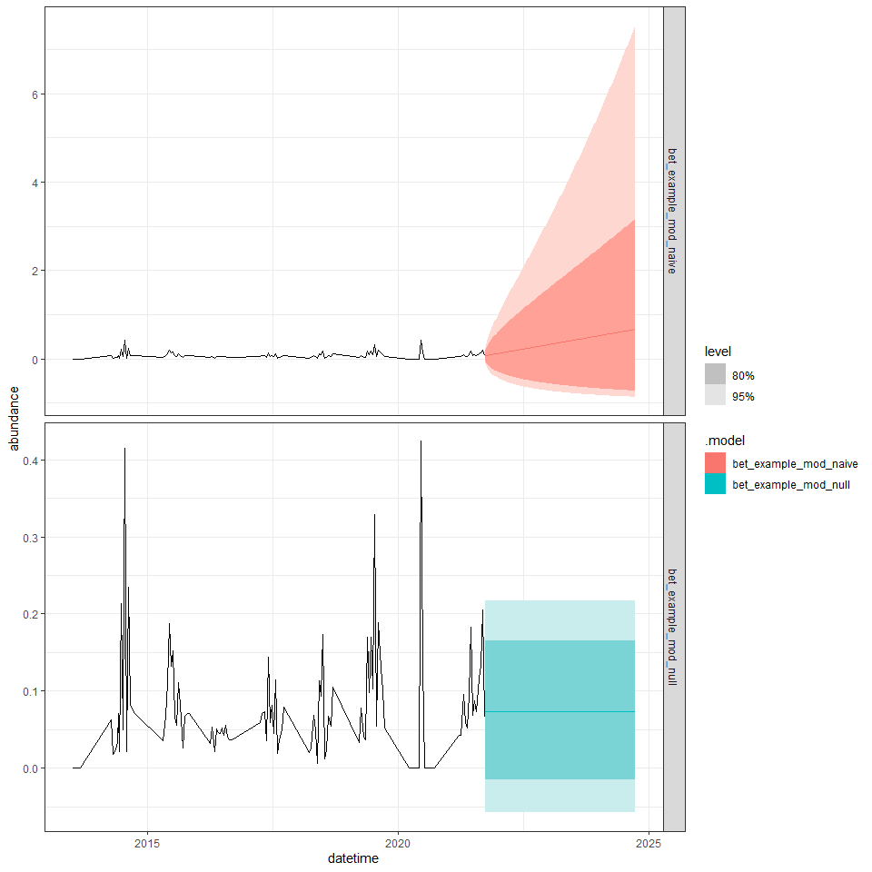
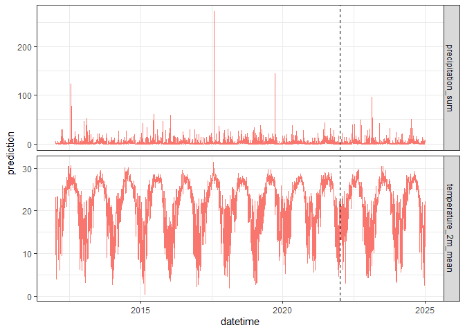
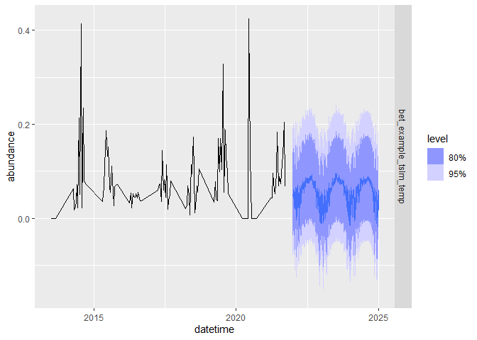

# 1 Learning objectives

-   Overview of the [Beetle
    Communities](https://projects.ecoforecast.org/neon4cast-docs/Beetles.html)
    theme for the [NEON Ecological Forecasting
    Challenge](https://projects.ecoforecast.org/neon4cast-ci/)
-   How to create a simple forecast for the Beetle Communities theme.
-   How to submit/score a forecast to evaluate its accuracy.
-   How to use the NEON Forecast Challenge resources in your research
    and teaching.

# 2 Things you will need to complete this tutorial

You will need a current version of R (v4.2 or newer) to complete this
tutorial. We also recommend the RStudio IDE to work with R.

To complete the workshop via this markdown document the following
packages will need to be installed:

-   `tidyverse`
-   `lubridate`
-   `tsibble`
-   `fable`
-   `fabletools`
-   `remotes` (to install neon4cast from gitHub)
-   `neon4cast` (from github)

The following code chunk should be run to install packages.

``` r
install.packages('tidyverse') # collection of R packages for data manipulation, analysis, and visualisation
install.packages('lubridate') # working with dates and times
install.packages('tsibble') # working with timeseries data
install.packages('fable') # running forecasts
install.packages('fabletools') # helper functions for using fable
install.packages('remotes')
install.packages('tsibble') # package for dealing with time series data sets and tsibble objects
remotes::install_github('eco4cast/neon4cast') # package from NEON4cast challenge organisers to assist with forecast building and submission
```

Then load the packages.

``` r
version$version.string
```

    ## [1] "R version 4.3.1 (2023-06-16 ucrt)"

``` r
library(tidyverse)
library(lubridate)
library(tsibble)
library(fable)
library(fabletools)
library(neon4cast)
```

# 3 Introduction

## 3.1 Purpose

This document provides a tutorial on how to prepare and submit forecasts
to the [NEON Ecological Forecasting
Challenge](https://projects.ecoforecast.org/neon4cast-ci/) [Beetle
Communities](https://projects.ecoforecast.org/neon4cast-docs/Beetles.html)
theme.

## 3.2 Introduction to NEON forecast challenge

The Challenge has been organized by the Ecological Forecasting
Initiative Research Coordination Network ([EFI
RCN](https://ecoforecast.org/)).

The Challenge asks the scientific community to produce ecological
forecasts of future observations of ecological data that will be
collected and published by the [National Ecological Observatory Network
(NEON)](https://www.neonscience.org/). The Challenge is split into five
themes that span aquatic and terrestrial systems, and population,
community, and ecosystem processes across a broad range of ecoregions.
We are excited to use this Challenge to learn more about the
predictability of ecological processes by forecasting NEON data before
it is collected.

Which modeling frameworks, mechanistic processes, and statistical
approaches best capture community, population, and ecosystem dynamics?
These questions are answerable by a community generating a diverse array
of forecasts. The Challenge is open to any individual or team from
anywhere around the world that wants to submit forecasts. Learn more
about how you can participate
[here.](https://projects.ecoforecast.org/neon4cast-ci/instructions.html).

## 3.3 Goals for forecasts of ecological communities

Ecologists are interested in tracking changes in the **number of
individual organisms over time** (count data of abundance). Numbers of
each species will change due to births, deaths, and movement in
(immigration) or out (emigration) of populations. The abundance of an
ecological community is the sum of the number of individuals of each
species. For example, in a hypothetical community of beetles sampled in
Year 1 (time=1) , Species A has 10 individuals, Species B has 40
individuals and Species C has 50 individuals, giving a community
abundance of 100. In subsequent years the abundance may increase,
decrease or remain constant. A forecast may use this sequence of
observations over time to predict how many individuals will occur in the
next year (time=2), or a number of years into the future (time n). How
far into the future we predict is known as the forecast horizon. The
accuracy of the prediction is then compared to new observations and a
new prediction is made.

Ecologists are also interested in tracking changes in the **number of
species over time** (Species richness over time without species
identity) and in species turnover over time steps where the identity of
the species is known. In the example above there are three species
(A,B,C) but over time this can change if for example Species C was to
decline from 10 to zero individuals then the species richness would be
2, or increase if two previously unobserved species (D & E) arrive into
the community, the species richness would be 4. Note that the loss of
species A and the arrival of D and E gives a net species richness of 4,
but without keeping track of the identity of the species we may be
unaware of how community composition is changing over time.

Ecological communities change for many reasons and so it is important to
understand the drivers of changes in abundance or species richness by
adding environmental variables into the models. By knowing how species
change over time we can use the driving variables to predict, or
forecast, the values for the abundance and species richness variables
for the ecological communities into the future.

## 3.4 Overview of the Beetle Communities theme

**What**: Forecast abundance and/or richness of ground beetles
(carabids) collected in pitfall traps, standardized to sampling effort
(trap night). More information about the NEON data product
(DP1.10022.001, Ground beetles sampled from pitfall traps) we are
forecasting can be found
[here](https://data.neonscience.org/data-products/DP1.10022.001). Note
that we are not downloading the target dataset from the NEON data
portal. Rather, we will download a version of the dataset that has been
simplified and preformatted for this challenge by the EFI RCN.
Specifically, the targets are:  
\* *abundance*: Total number of carabid individuals per trap-night,
estimated each week of the year at each NEON site \* *richness*: Total
number of unique ‘species’ in a sampling bout for each NEON site each
week.

**Where**: All 47 terrestrial [NEON
sites](https://www.neonscience.org/field-sites/explore-field-sites).

You can load a site list into R using the code below:

``` r
site_data <- read_csv("https://raw.githubusercontent.com/eco4cast/neon4cast-targets/main/NEON_Field_Site_Metadata_20220412.csv") %>%
  dplyr::filter(beetles == 1)
```

For this tutorial, we are going to focus on the [NEON site at
Ordway-Swisher Biological Station
(OSBS)](https://www.neonscience.org/field-sites/osbs) located in Domain
03 (D03) in Florida.

**When**: Target data are available as early as 2013 at some sites, and
data are available at all sites from 2019 on. Because pitfall trap
samples need to be sorted and individuals counted and identified, the
latency for data publication can be nearly a year. In this tutorial we
will train our models on data from 2013-2021 and we will make forecasts
for the 2022 season so that we can score them immediately.

## 3.5 Target user groups for this tutorial

This tutorial is intended to be used by forecasters at any stage of
expertise and may be used as a learning tool as an introduction to
forecasting properties of ecological populations or communities. Below,
we provide code for introductory examples to walk through the entire
process of creating and submitting a forecast to the NEON Ecological
Forecasting challenge. This includes:

1.  Accessing target datasets of NEON ground beetle richness and
    abundance
2.  Accessing climate forecast data to use as drivers in models
    predicting beetle data
3.  How to use the `fable` package for R to specify and fit models
4.  How to submit a forecast to the forecast challenge

Upon completing this tutorial, participants should be able to create and
submit forecasts to the Ground Beetle theme of the EFI RCN NEON
forecasting challenge.

# 4 The forecasting workflow

## 4.1 Define spatial and temporal parameters for our forecast

Here we set some values for variables in our code to identify the NEON
site and the forecast start and end dates. This will allow us to easily
adapt this code to future runs for at different sites. Note that
iformation on the NEON sites can be found on the [NEON
webpage](https://www.neonscience.org/field-sites/explore-field-sites).
It can be filtered to only include terrestrial sites. This table has
information about the field sites, including location, ecoregion,
information about the plots (e.g. elevation, mean annual precipitation
and temperature, and NLCD class).

``` r
# choose site
my_site = "OSBS"

# To download the NEON site infromation table:
# neon_site_info <- read_csv("https://www.neonscience.org/sites/default/files/NEON_Field_Site_Metadata_20231026.csv")

# date where we will start making predictions
forecast_date <- "2022-01-01" #fit up through 2021, forecast 2022 data

# date where we will stop making predictions
forecast_enddate <- "2025-01-01"
```

## 4.2 Read in the data

We start forecasting by first looking at the historic data - called the
‘targets’. These data are available with a latency of approximately 330
days. Here is how you read in the data from the targets file available
from the EFI server.

``` r
# beetle targets are here
url <- "https://sdsc.osn.xsede.org/bio230014-bucket01/challenges/targets/project_id=neon4cast/duration=P1W/beetles-targets.csv.gz"

# read in the table
targets <- read_csv(url) %>%
  mutate(datetime = as_date(datetime)) %>%  # set proper formatting
  dplyr::filter(site_id == my_site,  # filter to desired site
                datetime < "2022-12-31") # excluding provisional data 
```

Let’s take a look at the targets data!

    ## # A tibble: 11 × 6
    ##    project_id site_id datetime   duration variable  observation
    ##    <chr>      <chr>   <date>     <chr>    <chr>           <dbl>
    ##  1 neon4cast  OSBS    2017-06-12 P1W      richness       7     
    ##  2 neon4cast  OSBS    2017-06-26 P1W      abundance      0.0821
    ##  3 neon4cast  OSBS    2017-06-26 P1W      richness      10     
    ##  4 neon4cast  OSBS    2017-07-10 P1W      abundance      0.0446
    ##  5 neon4cast  OSBS    2017-07-10 P1W      richness       6     
    ##  6 neon4cast  OSBS    2017-07-24 P1W      abundance      0.114 
    ##  7 neon4cast  OSBS    2017-07-24 P1W      richness       8     
    ##  8 neon4cast  OSBS    2017-08-07 P1W      abundance      0.0196
    ##  9 neon4cast  OSBS    2017-08-07 P1W      richness       4     
    ## 10 neon4cast  OSBS    2017-08-21 P1W      abundance      0.0375
    ## 11 neon4cast  OSBS    2017-08-21 P1W      richness       6

## 4.3 Visualise the data

``` r
targets %>% 
  as_tsibble(index = datetime, key = variable) %>%
  autoplot() +
  facet_grid(variable ~ ., scales = "free_y") + 
  theme_bw() +
  theme(legend.position = "none")
```


<p class="caption">
Figure: Beetle targets data at OSBS
</p>

## 4.4 Create the training dataset

We will train our forecast models on target data from the beginning of
the dataset until our `forecast_date`, which we set above.

``` r
targets_train <- targets %>%
  filter(datetime < forecast_date) %>%
  pivot_wider(names_from = variable, values_from = observation) %>%
  as_tsibble(index = datetime)
```

## 4.5 Getting started: some simple models

-   Null models
    -   `fable::MEAN()`: Historical mean and standard deviation
    -   `fable::NAIVE()`: Random walk
-   Regression models with climate drivers (accessed from
    <https://open-meteo.com/>)
    -   Temperature: Daily mean temperature from CMIP6 climate model
        runs
    -   Precipitation: Daily cumulative precipitation from CMIP6 model
        runs
    -   Temperature + Precipitation

### 4.5.1 Forecast beetle abundance: null models

``` r
# specify and fit models
# Using a log(x + 1) transform on the abundance data
mod_fits <- targets_train %>% 
  tsibble::fill_gaps() %>%
  fabletools::model(
    bet_example_mod_null = fable::MEAN(log1p(abundance)),
    bet_example_mod_naive = fable::NAIVE(log1p(abundance))) # random walk model, requires gapfill

# make a forecast
fc_null <- mod_fits %>%
  fabletools::forecast(h = "3 years") 
```

<figure>

<figcaption aria-hidden="true">Figure: Beetle abundance forecast at
OSBS</figcaption>
</figure>

### 4.5.2 Forecast beetle abundance: regression models

Regression on climate model outputs allows us to make predictions about
future field seasons based on CMIP6 projections. We downloaded climate
model outputs from <https://open-meto.com> using the `RopenMeto`
package, which you can install using:
`remotes::install_github("FLARE-forecast/RopenMeteo")`.

So we do not overwhelm the open-meteo API, we have made the climate data
used in this tutorial available at: TBD CyVerse address

Climate model we’re using for this example is CMCC_CM2_VHR4

``` r
# Get climate data
path_to_clim_data <- "C:/Users/esokol/Box/00_MY_NEON/Forecasting_Beetles/future_climate_data/future_climate_2012-2050_OSBS_CMCC_CM2_VHR4.csv"

clim_long <- read_csv(path_to_clim_data)  %>%
        filter(datetime <= forecast_enddate)

# make a tsibble object
clim_long_ts <- clim_long %>%
  as_tsibble(index = datetime, 
             key = c(variable, model_id))

# make wide
clim_wide <- clim_long %>%
  select(-unit) %>%
  pivot_wider(names_from = variable, values_from = prediction)

# visualize climate data
clim_long_ts %>%
  ggplot(aes(datetime, prediction, color = model_id)) + 
  geom_line() +
  facet_grid(variable ~ ., scales = "free_y") +
  geom_vline(xintercept = lubridate::as_date(forecast_date),
             lty = 2) + 
  theme_bw() +
  theme(legend.position = "none")
```



Pick output from one model from the climate ensemble:

``` r
# subset into past and future datasets, based on forecast_date
clim_past <- clim_wide %>%
  filter(datetime < forecast_date,
         datetime > "2012-01-01")

clim_future <- clim_wide %>%
  filter(datetime >= forecast_date,
         datetime <= forecast_enddate)
```

Combine target and climate data to make a training dataset:

``` r
# combine target and climate data into a training dataset
targets_clim_train <- targets_train %>%
  left_join(clim_past)
```

Specify and fit simple linear regression models using `fable::TSLM()`,
examine model fit statistics.

``` r
# specify and fit model
mod_fit_candidates <- targets_clim_train %>%
  fabletools::model(
    bet_example_tslm_temp = fable::TSLM(log1p(abundance) ~ temperature_2m_mean),
    bet_example_tslm_precip = fable::TSLM(log1p(abundance) ~ precipitation_sum),
    bet_example_tslm_temp_precip = fable::TSLM(log1p(abundance) ~ temperature_2m_mean + precipitation_sum))

# look at fit stats
fabletools::report(mod_fit_candidates)
```

    ## # A tibble: 3 × 15
    ##   .model   r_squared adj_r_squared  sigma2 statistic p_value    df log_lik   AIC
    ##   <chr>        <dbl>         <dbl>   <dbl>     <dbl>   <dbl> <int>   <dbl> <dbl>
    ## 1 bet_exa…  0.0332         0.0245  0.00416    3.78    0.0544     2    149. -610.
    ## 2 bet_exa…  0.000797      -0.00829 0.00430    0.0877  0.768      2    147. -606.
    ## 3 bet_exa…  0.0333         0.0156  0.00420    1.88    0.158      3    149. -608.
    ## # ℹ 6 more variables: AICc <dbl>, BIC <dbl>, CV <dbl>, deviance <dbl>,
    ## #   df.residual <int>, rank <int>

Plot the predicted versus observed abundance data:

``` r
# visualize model fit
# augment reformats model output into a tsibble for easier plotting
fabletools::augment(mod_fit_candidates) %>%
  ggplot(aes(x = datetime)) +
  geom_line(aes(y = abundance, color = "Obs")) +
  geom_line(aes(y = .fitted, color = .model))
```


We could use all of these models to make an ensemble forecast, but for
simplicity, we will just take the best model (lowest AICc), and use that
to create a forecast:

``` r
# focus on temperature model for now
mod_best_lm <- mod_fit_candidates %>% select(bet_example_tslm_temp)
report(mod_best_lm)
```

    ## Series: abundance 
    ## Model: TSLM 
    ## Transformation: log1p(abundance) 
    ## 
    ## Residuals:
    ##      Min       1Q   Median       3Q      Max 
    ## -0.07759 -0.04002 -0.01051  0.02192  0.28585 
    ## 
    ## Coefficients:
    ##                      Estimate Std. Error t value Pr(>|t|)  
    ## (Intercept)         -0.031335   0.051783  -0.605   0.5463  
    ## temperature_2m_mean  0.003947   0.002029   1.945   0.0544 .
    ## ---
    ## Signif. codes:  0 '***' 0.001 '**' 0.01 '*' 0.05 '.' 0.1 ' ' 1
    ## 
    ## Residual standard error: 0.0645 on 110 degrees of freedom
    ## Multiple R-squared: 0.03324, Adjusted R-squared: 0.02445
    ## F-statistic: 3.782 on 1 and 110 DF, p-value: 0.054357

``` r
# make a forecast
# filter "future" climate data to target climate model
fc_best_lm <- mod_best_lm %>%
  fabletools::forecast(
    new_data = 
      clim_future %>%
      as_tsibble(index = datetime)) 

# visualize the forecast
fc_best_lm %>% 
  autoplot(targets_train) +
  facet_grid(.model ~ .)
```



``` r
# format for submission to EFI
# for non-normal distributions, efi_format function draws samples to create
# n time series to provide an estimate of uncertainty
# https://projects.ecoforecast.org/neon4cast-ci/instructions.html
# I'm putting "example" in the name so the model does not register as 
# an official entry to the challenge


# update dataframe of model output for submission
fc_climate_mods_efi <- fc_best_lm %>% 
  mutate(site_id = my_site) %>% #efi needs a NEON site ID
  neon4cast::efi_format() %>%
  mutate(
    project_id = "neon4cast",
    reference_datetime = forecast_date,
    duration = "P1W")
```
